<div align="center">

# 🎨 BrandForge AI

### Turn any website into a structured, reusable brand system — live.

**Paste a URL or company name. Get colors, typography, logo, voice, messaging, audience, competitors — every claim backed by live evidence, never invented.**

<br/>

[](https://nextjs.org/)
[](https://www.typescriptlang.org/)
[](https://tailwindcss.com/)
[](https://tinyfish.ai)
[](./LICENSE)

[✨ Live Demo](http://localhost:3000) · [📖 API Docs](http://localhost:3000/api-docs) · [🧪 Examples](http://localhost:3000/examples) · [🐞 Report an Issue](https://github.com/astitvasinghas17-rgb/BrandForge/issues)

</div>

---

## 📑 Table of Contents

- [What is BrandForge AI?](#-what-is-brandforge-ai)
- [See it in action](#-see-it-in-action)
- [Features](#-features)
- [How it works](#-how-it-works)
- [How TinyFish powers BrandForge](#-how-tinyfish-powers-brandforge)
- [The three API endpoints](#-the-three-api-endpoints)
- [Evidence-first philosophy](#-evidence-first-philosophy)
- [Project structure](#-project-structure)
- [Download & run on your device](#-download--run-on-your-device)
- [Getting a TinyFish API key](#-getting-a-tinyfish-api-key)
- [Usage guide](#-usage-guide)
- [Export formats](#-export-formats)
- [API reference](#-api-reference)
- [Environment variables](#-environment-variables)
- [Demo brands](#-demo-brands)
- [Troubleshooting](#-troubleshooting)
- [Tech stack](#-tech-stack)
- [Contributing](#-contributing)
- [License](#-license)

---

## 🤖 What is BrandForge AI?

**BrandForge AI** is a production-quality web application that inspects any company's **live website** and transforms what it finds into a **structured, reusable brand guide** — the kind of document a marketing team, designer, developer, or even another AI system can actually use.

Give it `https://stripe.com` — or just type `stripe` — and it returns:

| Output | Example |
|---|---|
| 🏷️ **Brand identity** | Name, tagline, description, dynamically-inferred category |
| 🎨 **Color palette** | Role-assigned colors (Primary / Secondary / Accent / Background / Text / Border) with HEX + RGB |
| ✍️ **Typography** | Observed font families with weights and heading/body roles |
| 🖼️ **Logo** | Typed asset (SVG / PNG / favicon) with reason + confidence |
| 🗣️ **Brand voice** | Personality, formality, technical level, persuasion style, real quoted examples |
| 💬 **Key messaging** | Value proposition, headlines, CTA patterns, recurring phrases |
| 🎯 **Target audience** | Only from explicit statements — never defaulted |
| ⚔️ **Competitor benchmark** | Dynamically discovered official competitors + comparison matrix |
| 🧾 **Evidence & confidence** | Every claim traced to a live source with Observed/Inferred labels |

> **Golden rule:** if the live site doesn't support a claim, BrandForge says **"Not detected"** instead of guessing.

---

## 👀 See it in action

### 1️⃣ Paste a URL or company name
 <!-- Replace with a real screenshot: homepage hero with URL input -->

### 2️⃣ Watch the live TinyFish stages
The generator shows exactly which stage is running — discovery → content → internal pages → visual identity → voice → benchmark → build. No dead spinners.

### 3️⃣ Get a 13-section brand intelligence report
Overview · Logo · Colors · Typography · Visual language · Voice · Messaging · Audience · Do/Don't · Benchmark · Evidence · Confidence · Export.

> 📸 **Tip for contributors:** take screenshots of your run and replace the placeholders above (`docs/screenshot-hero.png`, `docs/screenshot-report.png`).

---

## ✨ Features

- 🔗 **URL *or* company-name input** — `stripe` resolves to `https://stripe.com` via TinyFish Search, with the resolution shown in the report
- 🌐 **Arbitrary websites** — redirect-following, www-tolerant, SSRF-guarded; zero hardcoded brands
- 📄 **Multi-page extraction** — type-labelled internal pages (about / product / pricing / docs / help / blog / brand / contact), one per type for breadth
- 🎨 **Real palette science** — CSS variables, paint declarations, `rgb()/hsl()`, SVG fills, theme-color, colorimetric role assignment
- ✍️ **Observed-only typography** — `font-family`, `@font-face`, webfont links, weights, heading/body roles
- 🖼️ **Honest logo detection** — header context, alt text, filename signals; favicon explicitly labelled when it's the fallback
- 🗣️ **Independent voice endpoint** — separate pipeline, per-quote page sources, evidence-backed lexicon
- ⚔️ **Independent benchmark endpoint** — observed-category queries, official-domain resolution, relevance filter, comparison matrix, recorded skips
- 🧾 **Evidence-first UI** — `Observed` / `Inferred` badges, provider tags (`tinyfish:fetch`), per-field confidence + coverage score
- 📦 **One-click exports** — JSON (machine-readable) · Markdown (docs) · standalone Brand HTML
- 📚 **Built-in API docs** (`/api-docs`) and **live examples** (`/examples`)

---

## ⚙️ How it works

```mermaid
flowchart LR
    U["👤 URL or company name"] --> V["✅ Validate + normalize"]
    V --> S{"TinyFish Search?"}
    S -->|"a name was given"| R["🔍 Resolve official URL"]
    S -->|"a URL was given"| F
    R --> F["🛰️ TinyFish Fetch<br/>homepage: markdown + links<br/>+ images + metadata (ttl=0 live)"]
    F --> D["🧭 Discover type-labelled pages<br/>about · product · pricing · docs<br/>help · blog · brand · contact"]
    D --> M["🛰️ TinyFish Fetch<br/>internal pages (batched)"]
    M --> A["🎨 Asset evidence<br/>stylesheets · SVG fills<br/>theme-color · webfonts"]
    A --> I["🧠 Intelligence layer<br/>category · colors · fonts<br/>logo · voice · audience"]
    I --> E["🧾 Evidence + confidence<br/>Observed / Inferred"]
    E --> J[["📦 Structured JSON + report"]]
```



**Pipeline in words:** validate → resolve (Search if needed) → live Fetch homepage → discover internal pages → Fetch them → gather stylesheet/SVG asset evidence → normalize into brand intelligence → attach evidence + honest confidence → render the report and exports.

---

## 🛰️ How TinyFish powers BrandForge

All live-web reads flow through **one auditable module — `lib/tinyfish.ts`** — and the API key **never leaves the server**. Every fetched page is tagged `tinyfish:fetch` / `tinyfish:search` and shown per-source in the Evidence panel (§11). Check `GET /api/status` anytime for the live mode.

| Step | TinyFish operation | Why |
|---|---|---|
| Name → URL | `GET api.search.tinyfish.ai?query=<name> official website` | Company names resolve to official sites; the resolution string is displayed |
| Homepage | `POST api.fetch.tinyfish.ai` `{format:"markdown", links, image_links, page_metadata, ttl:0}` | Live copy, link graph, image assets, favicon/OG metadata (`ttl:0` = live, not cache) |
| Internal pages | Same Fetch, batched, type-labelled | Goes beyond the homepage |
| Visual evidence | Same Fetch `{format:"html"}` + the site's own stylesheets, SVG fills, theme-color, webfont links | Palette, fonts, logo evidence |
| Competitors | 3 Search discovery queries → mine listicle outbound links → Fetch each **official homepage** | Dynamic competitors; listicles are discovery evidence only, never listed as competitors |

> **Supplement rule:** page copy, structure and assets *always* come from TinyFish. One raw-HTML asset fetch exists only to locate stylesheet/SVG URLs that cleaned HTML strips out, and is labelled `direct:asset-discovery` in evidence. Without a key, the app runs in clearly-labelled `fallback:direct` mode.

---

## 🔌 The three API endpoints

Three **independent** pipelines — no shared computation, no renamed results:

### 1. `POST /api/brand/extract` — core identity extraction
Full brand identity: name, typed logo, role-assigned palette, observed typography, visual language, messaging, audience. Output shape is Zod-validated before responding.

### 2. `POST /api/brand/voice` — multi-page voice analysis
Own fetch pass over up to 9 pages: personality, formality, technical level, persuasion style, recurring phrases with **per-quote page sources**, evidence-backed words-to-use/avoid, quoted pain points (or an honest "not established").

### 3. `POST /api/brand/benchmark` — competitor discovery + comparison
Categorizes the target from observed copy → builds queries from the **observed** category (`Google search engine competitors`) → resolves listicles to **official homepages** → relevance-filters each candidate → returns per-competitor intelligence + a target-vs-competitors matrix + honest per-domain skips.

**Try them:**
```bash
curl -X POST http://localhost:3000/api/brand/extract \
  -H "Content-Type: application/json" \
  -d '{"url":"https://stripe.com"}'

curl -X POST http://localhost:3000/api/brand/voice \
  -H "Content-Type: application/json" \
  -d '{"company":"linear"}'

curl -X POST http://localhost:3000/api/brand/benchmark \
  -H "Content-Type: application/json" \
  -d '{"url":"https://notion.so"}'
```

---

## 🧾 Evidence-first philosophy

Every significant field is traceable:

- 🏷️ `Observed` (black badge) = seen live on the site · `Inferred` (amber badge) = derived and labelled · `Official` is never claimed unless a brand-guideline page says so
- Per-field **confidence (0–1)** plus an overall **evidence-coverage** score that *lowers* the headline number when evidence is thin
- Missing data → **"Not detected" / "Not reliably determined" / "Insufficient evidence"**
- Categories come from a 20-domain evidence-gated inference (Search → Nonprofit) — never defaulted to "AI SaaS"
- Audiences come from explicit statements (`for teams`, plan tiers, customer proof) — never defaulted to enterprise/developers
- Pain points are quoted problem-language with sources — generic SaaS pains are never generated

---

## 🗂️ Project structure

```
BrandForge/
├── app/
│   ├── page.tsx                    # Homepage: hero + generator + how-it-works + bounty proof
│   ├── examples/page.tsx           # Live demo entry points (Stripe, Linear, Notion, Vercel)
│   ├── api-docs/page.tsx           # Endpoint reference + TinyFish usage + curl examples
│   └── api/
│       ├── brand/extract/route.ts  # Endpoint 1 (Zod-validated output, 400/502/503/504 mapping)
│       ├── brand/voice/route.ts    # Endpoint 2 (independent multi-page analysis)
│       ├── brand/benchmark/route.ts# Endpoint 3 (official-domain competitors + matrix)
│       └── status/route.ts         # Live TinyFish mode probe
├── components/
│   ├── Generator.tsx               # URL input + live staged progress + orchestration
│   └── BrandReport.tsx             # 13-section report + JSON/Markdown/HTML export of real data
├── lib/
│   ├── tinyfish.ts                 # Centralized TinyFish Fetch/Search abstraction (server-only keys)
│   ├── category.ts                 # Evidence-gated category/audience/pain inference (anti-template)
│   ├── brand-extractor.ts          # Colors, fonts, logo, messaging, audience, confidence
│   ├── brand-voice.ts              # Independent voice pipeline
│   ├── benchmark.ts                # Independent competitor pipeline
│   └── schemas.ts                  # Zod input + output schemas, error mapping
├── public/                         # Static assets
├── .env.example                    # Required env vars (template — never commit real keys)
├── package.json
└── README.md
```

---

## 💻 Download & run on your device

### Prerequisites

| Requirement | Version | Check with |
|---|---|---|
| [Node.js](https://nodejs.org/) | 18 or newer | `node --version` |
| npm | comes with Node | `npm --version` |
| Git | any recent | `git --version` |
| A TinyFish API key | free | [agent.tinyfish.ai](https://agent.tinyfish.ai) |

### Step 1 — Download the code

```bash
# Clone the repository
git clone https://github.com/astitvasinghas17-rgb/BrandForge.git

# Enter the project folder
cd BrandForge
```

> 💡 Prefer ZIP? Open the repo page → green **Code** button → **Download ZIP**, then unzip and open a terminal inside the folder.

### Step 2 — Install dependencies

```bash
npm install
```

### Step 3 — Add your TinyFish API key

```bash
# macOS / Linux
cp .env.example .env

# Windows (PowerShell)
Copy-Item .env.example .env
```

Then open `.env` in any editor and paste your key:

```env
TINYFISH_API_KEY=sk-tinyfish-...your-key-here
```

> 🔑 **Get a key:** sign up at [agent.tinyfish.ai](https://agent.tinyfish.ai) — Search + Fetch are free at any wallet balance.
> 🔒 **Your key never leaves your machine.** It is read server-side only (`lib/tinyfish.ts`), is gitignored via `.env*`, and no frontend file references it — verified by automated scan.

### Step 4 — Run locally 🚀

```bash
npm run dev
```

Open **http://localhost:3000** 🎉 — paste `https://stripe.com` (or just `stripe`) and hit **Generate Brand Guide**.

### Step 5 — Production build (optional)

```bash
npm run build   # typecheck + optimized production build
npm start       # serve production on http://localhost:3000
```

### Available scripts

| Command | What it does |
|---|---|
| `npm run dev` | Start the development server (hot reload) |
| `npm run build` | Typecheck + create an optimized production build |
| `npm start` | Serve the production build |
| `npm run lint` | Run ESLint |

---

## 🔑 Getting a TinyFish API key

1. Go to **[agent.tinyfish.ai](https://agent.tinyfish.ai)** and create an account.
2. Open the **API Keys** page and generate a key (starts with `sk-tinyfish-…`).
3. Paste it into your local `.env` as `TINYFISH_API_KEY=…`.
4. Restart the dev server and confirm `GET /api/status` reports `"mode": "tinyfish-live"`.

Without a key the app still runs in labelled `fallback:direct` mode (same UI and pipeline), but live TinyFish extraction, Search resolution, and competitor discovery require it.

---

## 🧭 Usage guide

1. **Enter input** — a full URL (`https://linear.app`) or a company name (`notion`). Bare domains work too.
2. **Watch the stages** — discovery → content → internal pages → visual identity → voice → benchmark → build.
3. **Read the report** — 13 sections from overview to evidence, with confidence bars and provider tags.
4. **Export** — JSON for machines, Markdown for docs, standalone HTML for sharing. All exports contain *your actual generated result*.
5. **Explore** — `/examples` for one-click demos, `/api-docs` for endpoint details, `GET /api/status` for the TinyFish mode.

**Good first tests:** `stripe.com` (fintech), `linear.app` (dev tools), `notion.so` (productivity), `google.com` (search), plus any non-software site (e.g. a museum or restaurant) to see the category system refuse to guess SaaS.

---

## 📦 Export formats

| Format | Button | Contents |
|---|---|---|
| **JSON** | `JSON ↓` / `Copy JSON` | `schemaVersion`, brand, logo, colors, typography, voice, messaging, audience, do/don't, benchmark, evidence, confidence, sources — machine-readable |
| **Markdown** | `Markdown ↓` | Clean documentation: overview, palette, fonts, voice, audience, benchmark, evidence |
| **Brand HTML** | `Brand HTML ↓` | Standalone styled page — open in any browser, share with anyone |

---

## 📖 API reference

All endpoints accept `{ "url" }` — or `{ "company" }` / `{ "input" }` for name resolution.

| Endpoint | Method | Returns |
|---|---|---|
| `/api/brand/extract` | POST | `brand` (+dynamic `category`), `logo{url,type,reason}`, `colors[{hex,rgb,usage,source,evidence}]`, `typography{heading,body,all}`, `visualStyle`, `messaging`, `audience`, `confidence{overall,evidenceCoverage}`, `sources[{url,pageType}]`, `evidence[]`, `meta` |
| `/api/brand/voice` | POST | `voice{overall,personality,formality,technicalLevel,…}`, `messaging{ctaStyle,wordsToUse,wordsToAvoid,…}`, `audience{likelyAudience,painPoints}`, `examples[{original,analysis,source}]`, `evidence[]`, `meta` |
| `/api/brand/benchmark` | POST | `targetBrand`, `targetCategory{confidence,evidence}`, `competitors[{name,website,positioning,audience,headline,voice,cta,colors,typography,differentiators,evidence,confidence}]`, `comparison{matrix}`, `failures[]`, `discovery{queries,listiclesUsed}`, `sources[]` |
| `/api/status` | GET | `{configured, mode, fetchEndpoint, searchEndpoint}` |

**Error codes:** `400` invalid input/blocked host · `502` extraction/fetch failure · `503` TinyFish rate limit · `504` upstream timeout. Errors explain what happened — fake data is never substituted.

---

## 🔧 Environment variables

| Variable | Required | Description |
|---|---|---|
| `TINYFISH_API_KEY` | Yes for live extraction | Server-side TinyFish key. See `.env.example`. Never commit the real value. |

---

## 🧪 Demo brands

These are **test inputs only** — every data point is generated live through the same pipeline (check each report's Evidence §11). No brand data is hardcoded anywhere (verified by code search).

- **Stripe** — `https://stripe.com` → Financial Technology
- **Linear** — `https://linear.app` → Project Management
- **Notion** — `https://notion.so` → resolves to notion.com, multi-page extraction
- **Vercel** — `https://vercel.com` → arbitrary-site proof beyond the big three
- Plus non-software checks (e.g. a museum → Nonprofit) proving the system doesn't force SaaS templates

---

## 🛠️ Troubleshooting

<details>
<summary><b>Port 3000 is already in use</b></summary>

Run on another port: `npm run dev -- --port 3001`, then open http://localhost:3001.
</details>

<details>
<summary><b>`/api/status` says <code>fallback-direct</code></b></summary>

Your `.env` key isn't loaded. Check the file is named exactly `.env` in the project root, contains `TINYFISH_API_KEY=…` with no quotes/spaces, then restart the dev server.
</details>

<details>
<summary><b>Generation fails with a rate-limit message</b></summary>

TinyFish asked us to slow down (HTTP 503). Wait a few seconds and retry — nothing was fabricated.
</details>

<details>
<summary><b>A section says "Not detected"</b></summary>

That's the system working as designed: the live site didn't expose that evidence (common on heavily JS-bundled pages), so it refuses to guess. Confidence scores reflect this honestly.
</details>

<details>
<summary><b>Benchmark returns few or no competitors</b></summary>

Discovery is live and strict: irrelevant domains are rejected and skips are recorded in `failures`. Fewer honest competitors beats invented ones.
</details>

---

## 🧰 Tech stack

- **Next.js 16** (App Router, server-side API routes) · **React 19** · **TypeScript 5**
- **Tailwind CSS 4** · **Zod** validation · **TinyFish Fetch + Search**
- No database, no LLM key needed — deterministic, evidence-backed heuristics over live TinyFish data

---

## 🤝 Contributing

Issues and pull requests are welcome! Please keep the evidence-first contract: no hardcoded brand data, no invented fields, every new claim needs a source + confidence. Run `npx tsc --noEmit` and `npm run build` before submitting.

---

## 📄 License

MIT — see [LICENSE](./LICENSE) (or the [GitHub page](https://github.com/astitvasinghas17-rgb/BrandForge)) for details.

---

<div align="center">

**Built with 🛰️ TinyFish live-web extraction · No mock data · No hardcoded brands**

⭐ If this helped you, consider starring the repo!

</div>
